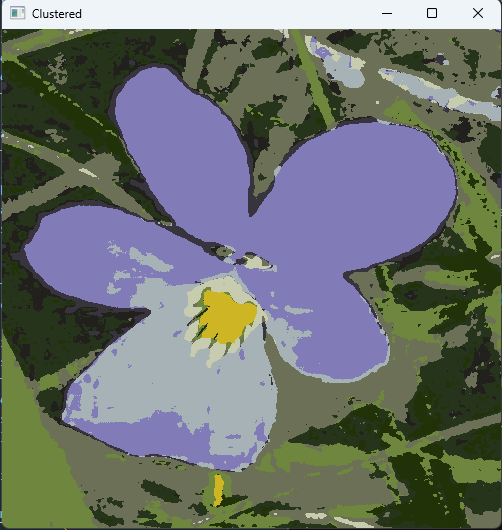

Midterm Computional Intelligence Project 

# Process on images
We first wrote a function to convert the pixels to a vector with 5 dimensions h,s,v,x,y. Also, the weight affects the values during the extraction of information, and since the spatial feature is not very important in the flower stream, the color coefficient and its mean are higher than the rest. After the features are extracted, we enter the execution phase of the K-Mean algorithm.

# K-Mean
Here we give the algorithm the features that we extracted from all the images in the form of a vector. The main challenge here is choosing n. We have two cases:
-  If we choose a small value for n, for example less than 5, the probability that the flower will also consider the environment as part of the flower is high, especially when the color of part of the flower exists in nature. An example of this can be seen in the images below.

- If n is large (more than 10), we can divide the flower into one cluster, which is ideal, but most likely the flower will be divided into more than one cluster. But this case is better than the previous one because we can merge the clusters that have the flower in them to a good extent by examining features such as spatial location, proximity, color variance, and setting a threshold.

## Why not Mean-Shift or DB-Scan
These two algorithms had a very high time complexity for images with a low number, and we have limitations on the space of RAM and computations for a high number of images. Therefore, it is not cost-effective.

# Extract Features of clusters
After dividing each image into n clusters with K-Mean, we need to extract the features of each cluster in each image so that we can classify the images with them. The features that we calculate for each cluster are:

- The average color of the cluster

With this feature, we can put flowers of the same color in one category.

- The color variance of the cluster

The color of a flower is not the same, and it has a different color around or in the middle, and therefore the rate of color change is also important for us to be able to separate the flower from the background.

- The area of each cluster: 

It is possible that the color of two flowers is the same, but they have different sizes.

# Clustering Clusters
Now we have to give all the clusters to the K-Mean algorithm. Here we expect the algorithm to separate the clusters of each flower. For example, red flowers in one cluster and yellow flowers in another cluster and so on. In this program, there is no algorithm yet to separate yellow flowers with different shapes.